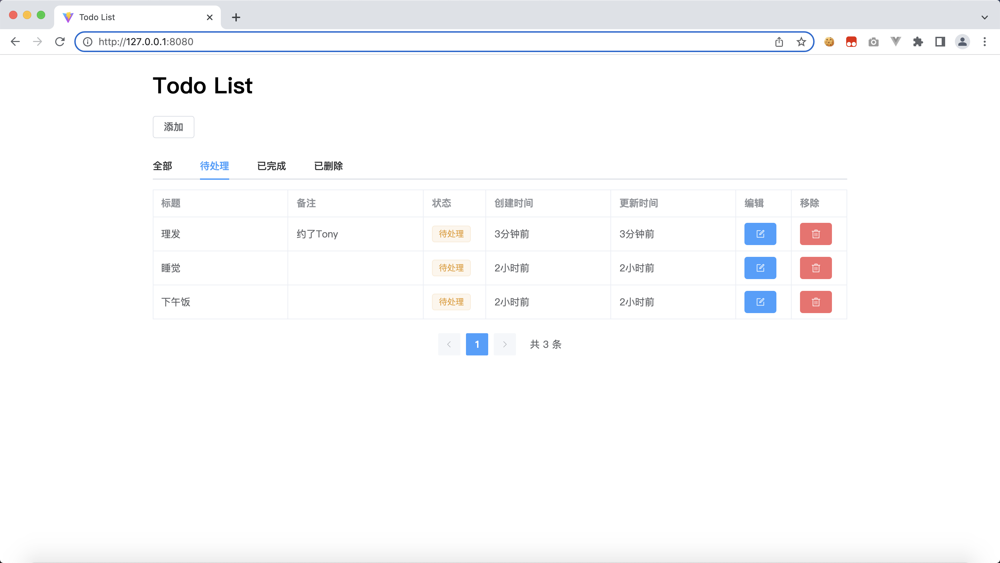

# Todo List



客户端使用服务端接口，可任意组合

```bash
todo-list-client  # 客户端实现
    /todo-list-client-vue
    /todo-list-client-vue-ts

todo-list-server  # 服务端实现
    /todo-list-server-go
    /todo-list-server-java
```

# 下载体验

下载地址：[https://github.com/mouday/todo-list/releases](https://github.com/mouday/todo-list/releases)

1、目录

```bash
.
├── golang
│   ├── todo-darwin                          # macOS
│   ├── todo-linux                           # linux
│   └── todo-windows.exe                     # windows
└── java
    └── todo-list-server-java-0.0.1.jar      # macOS/linux/windows
```

2、运行java版本

```bash
# 命令行执行
java -jar todo-list-server-java-0.0.1.jar
```

3、运行golang版本

```bash
# macOS
./todo-darwin

# linux
./todo-linux


# windows 可双击执行
./todo-windows.exe
```

4、浏览器打开地址

http://127.0.0.1:8080/
